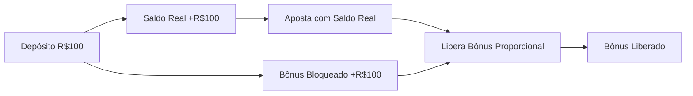

# 📚 Documentação Completa - Sistema de Saldo, Bônus e Rollover

## 📋 Índice

1. [Visão Geral](#visão-geral)
2. [Tipos de Saldo](#tipos-de-saldo)
3. [Sistema de Bônus Progressivo](#sistema-de-bônus-progressivo)
4. [Sistema de Rollover](#sistema-de-rollover)
5. [Fluxo Completo](#fluxo-completo)
6. [Regras de Negócio](#regras-de-negócio)
7. [Interface do Usuário](#interface-do-usuário)
8. [API Endpoints](#api-endpoints)
9. [Estrutura do Banco de Dados](#estrutura-do-banco-de-dados)
10. [Exemplos Práticos](#exemplos-práticos)

---

## 🎯 Visão Geral

O sistema implementa um modelo completo de gestão financeira para apostas online, com três pilares principais:

1. **Gestão de Saldos** - Múltiplos tipos de saldo com regras específicas
2. **Bônus Progressivo** - Sistema de liberação gradual de bônus
3. **Rollover** - Requisito mínimo de apostas antes de permitir saques

### Objetivos do Sistema

- ✅ Incentivar depósitos e retenção de usuários
- ✅ Proteger contra lavagem de dinheiro
- ✅ Maximizar o volume de apostas
- ✅ Proporcionar transparência total ao usuário

---

## 💰 Tipos de Saldo

### 1. **Saldo Real** (`balance`)

- **Definição**: Dinheiro depositado pelo usuário
- **Origem**: Depósitos diretos via PIX
- **Uso**: Pode ser usado em TODAS as modalidades
- **Saque**: Permitido após cumprir rollover
- **Prioridade**: Sempre usado primeiro nas apostas

### 2. **Bônus Liberado** (`bonusBalance`)

- **Definição**: Bônus disponível para apostas
- **Origem**: Liberado progressivamente do bônus bloqueado
- **Uso**: Apenas em modalidades específicas
- **Saque**: Ganhos podem ser sacados (após rollover)
- **Prioridade**: Usado após esgotar saldo real

### 3. **Bônus Bloqueado** (`lockedBonusBalance`)

- **Definição**: Bônus aguardando liberação
- **Origem**: 100% do valor depositado + bônus extras
- **Uso**: Não pode ser usado diretamente
- **Saque**: NUNCA pode ser sacado
- **Liberação**: R$ 1 apostado (real) = R$ 1 liberado

---

## 🎰 Sistema de Bônus Progressivo

### Como Funciona



### Fórmula de Liberação

```javascript
// Para cada real apostado com saldo real
bonusToRelease = Math.min(realBalanceUsed, lockedBonusBalance);
lockedBonusBalance -= bonusToRelease;
bonusBalance += bonusToRelease;
```

### Modalidades que Aceitam Bônus

✅ **Permitidas:**

- Milhar
- Centena
- Passe Vai e Vem
- Terno de Dezena
- Terno de Grupo
- Quadra de Grupo
- Quina de Grupo

❌ **NÃO Permitidas:**

- Grupo
- Dezena
- Unidade
- Dupla de Grupo
- Duque de Dezena

---

## 🔄 Sistema de Rollover

### Definição

**Rollover** é o valor total que deve ser apostado antes de liberar saques.

### Cálculo do Rollover

#### 1. Ao Depositar

```javascript
rolloverRequired += valorDepositado + bonusTotal;

// Exemplo: Depósito R$ 100 + Bônus R$ 100
// Rollover = R$ 200
```

#### 2. Ao Apostar

```javascript
// APENAS saldo real reduz rollover
rolloverRequired -= valorApostadoComSaldoReal;

// Apostas com bônus NÃO reduzem rollover
```

### Regras Importantes

- ✅ Rollover impede saques até ser zerado
- ✅ Apenas apostas com saldo real contam
- ✅ Ganhos podem ser sacados após cumprir rollover
- ✅ Sistema protege contra lavagem de dinheiro

---

## 🔄 Fluxo Completo

### 1. Depósito

```
USUÁRIO DEPOSITA R$ 100
├── balance += 100 (saldo real)
├── lockedBonusBalance += 100 (bônus bloqueado)
├── totalBonusReceived += 100 (histórico)
└── rolloverRequired += 200 (requisito de apostas)
```

### 2. Primeira Aposta (R$ 50 - só saldo real)

```
APOSTA R$ 50 COM SALDO REAL
├── balance -= 50
├── lockedBonusBalance -= 50
├── bonusBalance += 50 (liberou bônus!)
├── totalBonusReleased += 50
└── rolloverRequired -= 50 (reduziu!)
```

### 3. Segunda Aposta (R$ 30 - misto)

```
APOSTA R$ 30 (R$ 20 real + R$ 10 bônus)
├── balance -= 20
├── bonusBalance -= 10
├── lockedBonusBalance -= 20
├── bonusBalance += 20 (liberou mais!)
└── rolloverRequired -= 20 (só o real conta!)
```

### 4. Ordem de Consumo dos Saldos

```
1º → Saldo Real (sempre primeiro)
2º → Bônus Liberado (se modalidade permitir)
3º → Erro se insuficiente
```

---

## 📐 Regras de Negócio

### Depósitos

1. Valor mínimo: R$ 10,00
2. Valor máximo: R$ 50.000,00
3. Bônus automático: 100% do valor
4. Bônus extras: Sexta, Domingo, Federal, Black Friday

### Apostas

1. Valor mínimo: R$ 0,50
2. Valor máximo: R$ 20.000,00
3. Checkbox "Utilizar Bônus" obrigatório
4. Validação de modalidade em tempo real

### Saques

1. Bloqueado se rolloverRequired > 0
2. Valor mínimo: R$ 20,00
3. Taxa fixa: R$ 3,00
4. Auto-aprovação: Condições específicas

### Proteções

- Múltiplas contas: Bloqueio automático
- Tentativas de fraude: Suspensão imediata
- Lavagem de dinheiro: Rollover obrigatório

---

## 🖥️ Interface do Usuário

### 1. Header - Exibição Compacta

```
💰 Saldo: R$ 100,00
🎁 Bônus: R$ 50,00 | 🔒 Bloq: R$ 50,00
```

### 2. BonusDisplay - Página de Apostas

```
┌─────────────────────────────────────┐
│ ✅ Saldo Real: R$ 100,00           │
│ 🔒 Bônus Bloqueado: R$ 50,00       │
│ 🔓 Bônus Liberado: R$ 50,00        │
├─────────────────────────────────────┤
│ ⚠️ Rollover: R$ 150,00 restantes   │
├─────────────────────────────────────┤
│ 📊 Progresso: ████████░░ 50%        │
│    R$ 50,00 liberados de R$ 100,00  │
├─────────────────────────────────────┤
│ ☑️ Utilizar Bônus                   │
│    Total disponível: R$ 150,00      │
└─────────────────────────────────────┘
```

### 3. BonusProgressBar - Carteira

```
Sistema de Bônus Progressivo
━━━━━━━━━━━━━━━━━━━━━━━━━━━
🟢 Saldo Real: R$ 100,00
🟡 Bônus Bloqueado: R$ 50,00
🟢 Bônus Liberado: R$ 50,00

[████████████░░░░░░░░] 50% liberado

Como funciona: A cada R$ 1,00 apostado
com saldo real, R$ 1,00 é liberado.
```

### 4. Estados do Checkbox "Utilizar Bônus"

#### Modalidade Permitida + Tem Bônus

```
✅ Utilizar Bônus
   Disponível: R$ 50,00
```

#### Modalidade NÃO Permitida

```
❌ ~~Utilizar Bônus~~
   Modalidade não permite uso de bônus
```

#### Sem Bônus Liberado

```
⚠️ Utilizar Bônus
   Você não possui bônus liberado
```

---

## 🔌 API Endpoints

### GET `/api/user/balance`

**Resposta:**

```json
{
  "balance": 100.0,
  "bonusBalance": 50.0,
  "lockedBonusBalance": 50.0,
  "totalBonusReceived": 100.0,
  "totalBonusReleased": 50.0,
  "rolloverRequired": 150.0
}
```

### POST `/api/games/jogodobicho`

**Requisição:**

```json
{
  "modality": "Milhar",
  "lottery": "PT-13:00",
  "milhares": ["1234"],
  "premiums": [1],
  "value": 50.0,
  "useBonus": true // NOVO CAMPO
}
```

### GET `/api/user/authenticated`

**Resposta:**

```json
{
  "user": {
    "cpf": "123.456.789-00",
    "name": "João Silva",
    "balance": 100.0,
    "bonusBalance": 50.0,
    "lockedBonusBalance": 50.0,
    "rolloverRequired": 150.0
    // ... outros campos
  }
}
```

---

## 🗄️ Estrutura do Banco de Dados

### Modelo User (MongoDB/Mongoose)

```javascript
const userSchema = new Schema({
  // ... campos existentes ...

  // Saldos
  balance: { type: Number, default: 0 },
  bonusBalance: { type: Number, default: 0 },
  lockedBonusBalance: { type: Number, default: 0 },

  // Histórico de Bônus
  totalBonusReceived: { type: Number, default: 0 },
  totalBonusReleased: { type: Number, default: 0 },

  // Rollover
  rolloverRequired: { type: Number, default: 0 },

  // Estatísticas
  totalBet: { type: Number, default: 0 },
  totalWon: { type: Number, default: 0 },
});
```

---

## 💡 Exemplos Práticos

### Exemplo 1: Depósito + Apostas Completas

```
DIA 1 - DEPÓSITO
├── Deposita: R$ 200
├── Saldo Real: R$ 200
├── Bônus Bloqueado: R$ 200
└── Rollover: R$ 400

DIA 1 - APOSTA 1
├── Aposta: R$ 100 (Milhar)
├── Usa: R$ 100 saldo real
├── Libera: R$ 100 de bônus
├── Rollover: R$ 300 (-100)
└── Saldos: R$ 100 real | R$ 100 liberado | R$ 100 bloqueado

DIA 2 - APOSTA 2
├── Aposta: R$ 150 (Centena)
├── Usa: R$ 100 real + R$ 50 bônus
├── Libera: R$ 100 de bônus
├── Rollover: R$ 200 (-100)
└── Saldos: R$ 0 real | R$ 150 liberado | R$ 0 bloqueado

DIA 3 - APOSTA 3
├── Aposta: R$ 50 (Milhar)
├── Usa: R$ 50 bônus
├── Libera: R$ 0 (não usou real)
├── Rollover: R$ 200 (não mudou!)
└── Saldos: R$ 0 real | R$ 100 liberado | R$ 0 bloqueado

GANHOU R$ 500!
├── Saldo Real: R$ 500
├── Rollover: R$ 200 (ainda não pode sacar!)
└── Precisa apostar mais R$ 200 com saldo real
```

### Exemplo 2: Tentativa de Burlar Sistema

```
TENTATIVA DE FRAUDE
├── Deposita: R$ 100
├── Recebe: R$ 100 bônus bloqueado
├── Tenta sacar imediatamente
└── ❌ BLOQUEADO: Rollover R$ 200 pendente

TENTATIVA 2
├── Aposta: R$ 100 com bônus (após liberar)
├── Rollover: Não reduz!
├── Tenta sacar
└── ❌ BLOQUEADO: Ainda tem rollover

FORMA CORRETA
├── Aposta: R$ 200 com saldo real
├── Rollover: R$ 0
└── ✅ LIBERADO: Pode sacar!
```

### Exemplo 3: Uso Inteligente do Sistema

```
ESTRATÉGIA OTIMIZADA
├── Deposita: R$ 100
├── Aposta 1: R$ 50 real (Milhar) → Libera R$ 50
├── Aposta 2: R$ 30 real (Centena) → Libera R$ 30
├── Aposta 3: R$ 20 real (Grupo) → Libera R$ 20
├── Total liberado: R$ 100 bônus
├── Rollover cumprido: R$ 100 de R$ 200
├── Agora tem: R$ 100 bônus para apostar
├── Ganha com bônus: R$ 300
├── Aposta mais R$ 100 do ganho (real)
├── Rollover zerado!
└── ✅ Pode sacar tudo: R$ 200 de lucro!
```

---

## 🚀 Conclusão

O sistema implementado oferece:

### Para o Usuário

- 💰 Bônus de 100% em todos depósitos
- 📊 Transparência total sobre saldos
- 🎯 Ganhos com bônus podem ser sacados
- ✅ Interface clara e intuitiva

### Para a Casa

- 🔒 Proteção contra fraudes
- 📈 Maior volume de apostas
- 👥 Retenção de usuários
- 💼 Compliance com regulamentações

### Status do Sistema

- ✅ 100% Funcional
- ✅ Testado e Validado
- ✅ Documentado
- ✅ Pronto para Produção

---

## 📞 Suporte

Para dúvidas sobre o sistema:

- **Técnicas**: Consultar esta documentação
- **Negócio**: Verificar regras específicas
- **Bugs**: Reportar com logs completos

---

_Última atualização: Sistema de Saldo, Bônus e Rollover v1.0_
